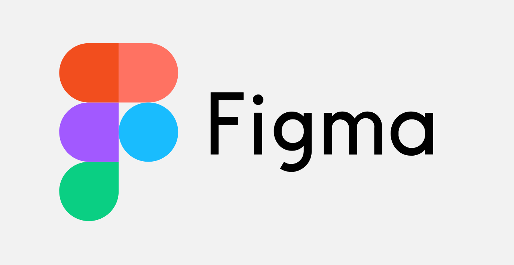
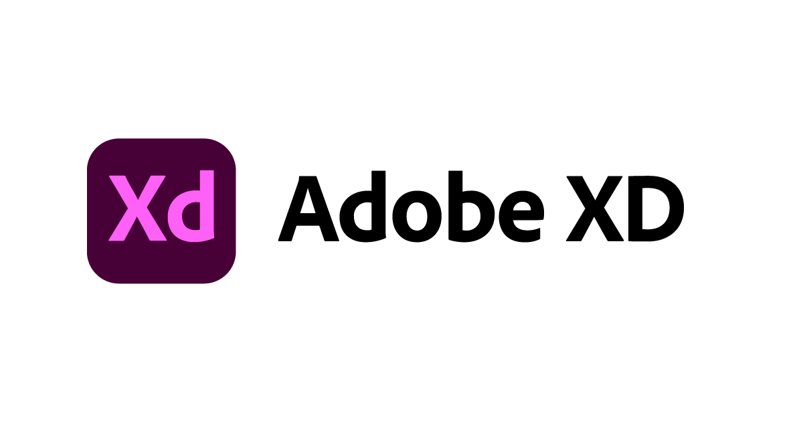
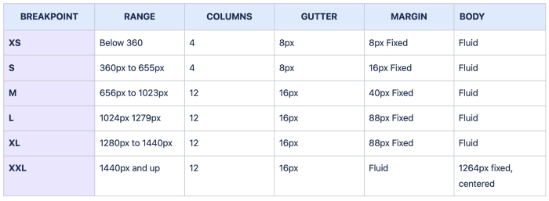
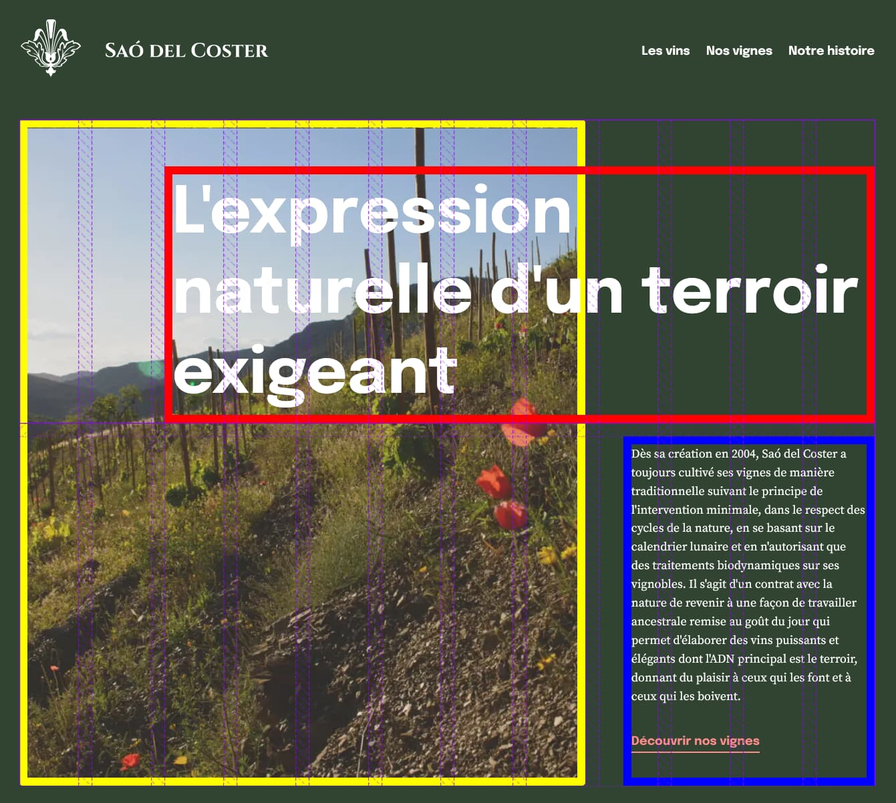
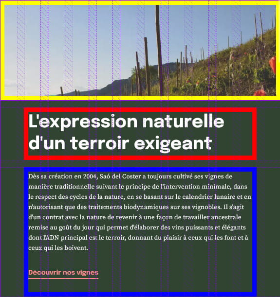

#### 🇬🇧 If you want to translate this checklist into your language, feel free to create a [pull request](https://github.com/benjaminhaeberli/checklist-design-web/pulls) with the translation !

---

# Checklist du design web 🖌️

## Pourquoi et comment utiliser cette checklist ?

J’ai conçu cette checklist, [basée sur celle de David Dias](https://github.com/thedaviddias/Front-End-Design-Checklist), afin de de simplifier la collaboration entre les designers et les développeur·euse·s. Il est primordial pour les designers de prendre en considération l’aspect technique lors de la conception pour éviter des problèmes d’intégration lors du développement. Ces deux métiers sont complémentaires et je suis convaincu que chacun·e doit connaître les contraintes de l’autre pour un rendu optimal.

Si vous êtes designer, je peux vous garantir qu’en utilisant cette checklist les développeur·euse·s vous seront très reconnaissant·e·s. À l’inverse, si vous êtes développeur·euse, adaptez cette checklist à votre méthodologie et partagez là aux designers avec qui vous travaillez.

Cette checklist est également disponible sur [Notion](https://benjaminhaeberli.notion.site/Checklist-du-designer-web-8ed31e4854a249dc9680f0ba8bcadd1d) 😉

## Table des matières 📄

- **[1 - Design](#1---design)**
  - [1.1 Outils](#11---outils)
  - [1.2 Styleguide et composants](#12---styleguide-et-composants)
  - [1.3 Grille](#13---grille)
  - [1.4 Couleurs](#14---couleurs)
  - [1.5 Typographie](#15---typographie)
  - [1.6 Images et icônes](#16---images-et-icônes)
  - [1.7 Liens et navigation](#17---liens-et-navigation)
  - [1.8 Formulaires et boutons](#18---formulaires-et-boutons)
  - [1.9 Responsive](#19---responsive)
- **[2 - Livraison](#2---livraison)**

# 1 - Design

## 1.1 - Outils

Pour faciliter le workflow (export des assets, compréhension du design), je ne travaille plus qu’avec [Figma](https://www.figma.com/) et [Adobe XD](https://www.adobe.com/ch_fr/products/xd.html) qui selon moi sont les meilleurs du marché et disponible sur toutes les plateformes. Pour avoir essayé les deux, je recommande [Figma](https://www.figma.com/) sans hésiter.

Si tu fais partie des dinosaures qui n’utilise pas encore un de ces deux outils, comment procèdes-tu ?

    
    

## 1.2 - Styleguide et composants

- [ ] Tous les **composants** sont créés avec l'approche « [Atomic Design](https://bradfrost.com/blog/post/atomic-web-design/) ». Dans le cas contraire, des problèmes peuvent survenir en termes de performance et de maintenabilité du projet.
- [ ] Un **styleguide** (aussi appelé « guide de style ») au format **Figma** ou **Adobe XD** est fourni : il regroupe tous les éléments, composants, styles et dimensions utilisés dans le design.

**Ressources** :

- 📖 [Atomic Design : Complete Guide](https://atomicdesign.bradfrost.com/table-of-contents/) – Brad Frost
- 📖 [Everything you need to know about Design Systems](https://uxdesign.cc/everything-you-need-to-know-about-design-systems-54b109851969) – Audreys Hacq
- 📖 [How To Create a Complete Web Design Style Guide](https://elementor.com/blog/web-design-style-guide/)
- 📚 [Styleguides.io](http://Styleguides.io) – Ressources pour la création de styleguides (exemples, outils, articles, etc.)

## 1.3 - Grille

- [ ] Pour les **mises en page standard** (colonnes et lignes), tous les éléments sont gérés via des « [Auto Layout](https://help.figma.com/hc/fr/articles/360040451373-Cr%C3%A9ation-de-designs-dynamiques-avec-la-disposition-automatique) » sur **Figma** ou « [Stacks](https://helpx.adobe.com/fr/xd/help/create-dynamic-designs-with-stacks.html) » sur **Adobe XD**
- [ ] Pour les **mises en page complexes**, notamment des éléments qui se chevauchent, des **grille standardisées** sont utilisées. Tous les détails de celles-ci (largeur, gouttières, nombre de colonnes, marges) doivent être spécifiés. Le standard actuel est d’utiliser un multiple de 8 pour les gouttières et un nombre pair de colonnes (4 pour mobile et 12 pour desktop).

    
    
Proposition de configuration de grille se basant sur les tailles d’écrans standards

    
    

    
Exemple de l'utilisation d’une grille avec sa déclinaison mobile

**Ressources :**

- 📖 [Responsive layouts grid guide for designers](https://uxdesign.cc/responsive-layout-grid-guide-for-designers-c3ba7d161bdf) pour comprendre le fonctionnement d’une grille
- 🛠 [Grid Calculator](http://gridcalculator.dk/) pour calculer vos tailles de colonnes
- 📖 [Guide : Créer et gérer ses grilles sur Figma](https://help.figma.com/hc/en-us/articles/360040450513-Create-layout-grids-with-grids-columns-and-rows)
- 📖 [Guide : Créer et gérer ses grilles sur Adobe XD](https://helpx.adobe.com/xd/help/work-with-guides-and-grids-in-adobe-xd.html) pour créer et gérer ses grilles

## 1.4 - Couleurs

- [ ] Toutes les couleurs utilisées dans les créations sont **nommées en anglais** de manière cohérente.
  > gray-light, gray-dark, green  
  > body-background, body-copy, text-paragraph
- [ ] Le **niveau de contraste** pour tous les éléments graphiques est au minimum « AA »

**Ressources :**

- 🛠 [WCAG : Contrast Checker](https://contrastchecker.com/) pour vérifier le niveau de contraste
- 📖 [MDN : Contraste de la couleur - Accessibilité](https://developer.mozilla.org/fr/docs/Web/Accessibility/Understanding_WCAG/Perceivable/Color_contrast)

## 1.5 - Typographie

- [ ] Deux polices de caractères maximum (trois en cas d’application très complexe) sont utilisées pour le design et celles-ci sont optimisées pour le web.
- [ ] Les polices pour le bureau (TTF ou OTF en général) et les polices pour le web, au format **WOFF et WOFF2** ont été fournies (toutes variantes comprises).
- [ ] Des **polices de secours** (aussi appelées « [fallback fonts](https://en.wikipedia.org/wiki/Fallback_font) ») sont spécifiées.
- [ ] Le **poids total** de toutes les polices ne dépasse pas 1 à 2 Mo, toutes variantes comprises.
- [ ] Dans la mesure du possible, tous les textes sont fournis dans la **langue appropriée** au lieu de textes factices comme du Lorem Ipsum. Cela est encore plus important pour les applications multilingues car la longueur d’une section ou d’un titre peut varier d’une langue à l’autre.

**Ressources :**

- 📖 [Les bases de la typographie web](https://raidboxes.io/fr/blog/webdesign-development/typographie-grundlagen-webfonts-tipps/) – Raidboxes
- 🛠 [Google Webfonts Helper](https://google-webfonts-helper.herokuapp.com/) pour télécharger les polices Google en local
- 🛠 [Transfonter](https://transfonter.org/) pour convertir les polices au format web et générer le CSS approprié

## 1.6 - Images et icônes

- [ ] Toutes les **images** (JPEG, PNG) doivent être fournies en résolution 1x et 2x afin de supporter [les écrans Retina](https://www.anthedesign.fr/creation-de-sites-internet/retina-design-web/). Je m’occupe ensuite de convertir les images en format « Next Gen » (WEBP, AVIF) avec [Squoosh](https://squoosh.app/) ou similaire.
- [ ] Une **image de favicon** d'au moins `512px` \* `512px` est fournie au format PNG, JPG ou SVG. La génération de tous les autres favicons peut être facilement réalisée avec des [Favicon Generator](https://realfavicongenerator.net/).
- [ ] Une image « [open graph](https://simplified.co/blog/design-hacks/open-graph-image-everything-you-need-to-know/) » de `1200px` \* `600px` est fourni au format JPEG. Elle sera utilisée par défaut lorsque le site sera partagé sur les réseaux sociaux.
- [ ] Toutes les **icônes** sont fournies au **format SVG**, chacune ayant le même ratio, en noir et optimisés pour le web avec [SVGOMG](https://jakearchibald.github.io/svgomg/) (tout cocher sauf les cases qui modifient le rendu final). Le nom de chaque icône commence par `icon-` et est entièrement en minuscules (sans espace et en utilisant des tirets pour séparer chaque mot).

**Ressources :**

- 🛠 [Favicon Generator](https://realfavicongenerator.net/) pour générer toutes les versions du **favicon**
- 🛠 [SVGOMG](https://jakearchibald.github.io/svgomg/) pour optimiser les SVG

## 1.7 - Liens et navigation

- [ ] Tous les **liens** ont cinq états définis : l’état par défaut, l’état de survol, l’état cliqué, l’état focus et l’état inactif.
- [ ] Tous les **éléments du menu** ont six états définis : l’état par défaut, l’état actif (page courante) l’état de survol, l’état cliqué, l’état focus et l’état inactif.
- [ ] Tous les **liens externes** (qui renvoient vers un autre site) sont identifiables par leur style. Je recommande l’utilisation d’un icône SVG comme [celui utilisé par Mozilla](./images/external_link.svg), à placer sur la droite du lien.

## 1.8 - Formulaires et boutons

- [ ] Tous les **champs de saisie** ont cinq états définis : l’état par défaut, l’état de survol, l’état focus, l’état erreur et l’état inactif.
- [ ] Tous les **boutons** ont cinq états définis : l’état par défaut, l’état de survol, l’état cliqué, l’état focus et l’état inactif.
- [ ] Les **boutons primaires et secondaires** sont clairement identifiables et sont utilisés selon les bonnes pratiques web.
- [ ] Les **champs obligatoires** sont identifiables par le style grâce à une icône et/ou une couleur.
- [ ] Des **exemples de messages** d’erreurs sont fournis. Leur position et leur couleur sont clairement identifiables.

**Ressources :**

- 📖 [Forms Need Validation](https://medium.com/nextux/forms-need-validation-2ecbccbacea1) – Andrew Coyle
- 📖 [Primary & Secondary Action Buttons](https://uxplanet.org/primary-secondary-action-buttons-c16df9b36150) – UX Planet
- 📖 [Design Better Forms](https://medium.com/nextux/design-better-forms-96fadca0f49c) – Andrew Coyle
- 📖 [Design Better Input Fields](https://medium.com/nextux/design-better-input-fields-3d02985a8e24) – Andrew Coyle
- 📖 [Designing Perfect Text Field: Clarity, Accessibility and User Effort](https://uxplanet.org/designing-perfect-text-field-clarity-accessibility-and-user-effort-d03c1e26004b) – Nick Babich
- 📖 [Button UX Design: Best Practices, Types and States](https://uxplanet.org/button-ux-design-best-practices-types-and-states-647cf4ae0fc6) – Nick Babich

## 1.9 - Responsive

- [ ] La **version mobile** de la conception est fournie avant ou en même temps que la version de desktop.
  > Si l'équipe de création n'a pas suivi le principe du « [mobile first](https://www.anthedesign.fr/webdesign-2/mobile-first/) », certaines irrégularités et incohérences peuvent apparaître entre la version mobile et la version de bureau. Vérifiez et signalez ces problèmes avant de commencer le développement du projet.
- [ ] En cas de structure de page complexe ou d’animations spécifiques, la **version tablette** du design doit également être prévue.

⚠️ La notion de « pixel perfect » est d'une certaine manière dépréciée. Aujourd'hui, il est impossible d'avoir un design qui fonctionne de la même manière face à la multitude des tailles d'écran et de technologies.

# 2 - Livraison

- [ ] Pour tous les sites web, au moins 2 versions du design sont fournis (mobile, desktop et éventuellement tablette) ainsi que le **styleguide**.
- [ ] Les fichiers **Figma** ou **Adobe XD** sont nettoyés avant d'être livrés. Les calques vides et inutiles doivent être supprimés pour faciliter l’intégration.
- [ ] La **page d'erreur 404** et éventuellement la page d'erreur 500 ont été conçues.
- [ ] Les pages **Mentions légales** et **Politique de confidentialité** ont été conçues (pages de texte simples).
- [ ] Tous **les composants ont été validés** par le·la développeur·euse comme réalisables techniquement et compatibles avec la stack technique qui sera utilisée

**Ressources :**

- 📖 [Modèles de pages RGPD](https://github.com/benjaminhaeberli/modeles-rgpd-web)

---

### Crédits

- Auteur : **[Benjamin Haeberli](https://benjaminhaeberli.ch/)**
- Contributeurs : [Tous les contributeurs](https://github.com/benjaminhaeberli/checklist-design-web/graphs/contributors)
- Inspirée de la [Front-End-Design-Checklist](https://github.com/thedaviddias/Front-End-Design-Checklist)
- License : [GNU GPLv3](https://choosealicense.com/licenses/gpl-3.0/)
